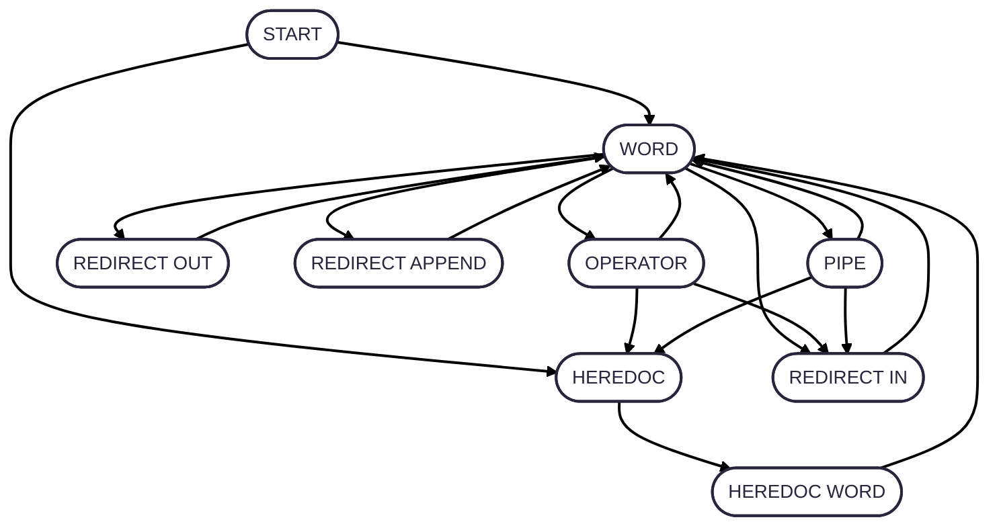

## To create the best tokeniser

to create the best tokeniser i think we need to create a FSM to ensure that all tokens are valid
both in relation to their neighbors but also to the current pipeline.

we might need to reduce the number of token types to allow it to make more sense.

I think to create a good FSM we need to make sure that all tokens are preceded and proceded by valid tokens

one good way to check this would be with a function that takes two states, the prev and the next, 
we can then do a lookup in a small static constant array of potential transitions of state, if the lookup does
not succeed then we have reached an error state, if the state is found then we continue to parse the next token.

